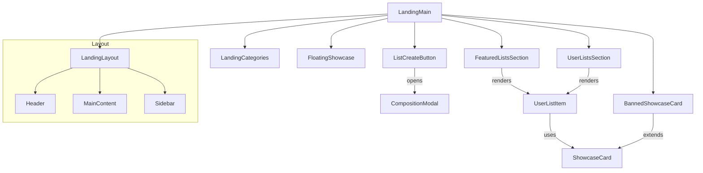

# Subtle 3D Tilt & Parallax Hover for ShowcaseCards

## Metadata
- **Category**: ui
- **Effort**: Medium (2/3)
- **Impact**: High (3/3)
- **Scan Type**: delight_designer
- **Generated**: 11/23/2025, 11:38:01 AM

## Description
Add a gentle 3D tilt and parallax effect to each ShowcaseCard and UserListItem when hovered or focused. Use `framer-motion` to animate rotation and slight perspective changes, making cards feel physically responsive to pointer movement. Include a micro-ease transition so the effect feels natural and not jarring.

## Reasoning
The tactile response reinforces the interactive nature of the cards, encouraging exploration and engagement. This small animation elevates the visual hierarchy without compromising performance, delivering a high-impact UX enhancement with medium effort.

## Context

**Note**: This section provides supporting architectural documentation and is NOT a hard requirement. Use it as guidance to understand existing code structure and maintain consistency.

### Context: Landing

**Description**: # Landing Feature

## Overview

The **Landing** context implements the front‑page experience for the application. It assembles several sub‑components—featured lists, user‑created lists, categories, showcase cards, and floating UI—to give visitors a compelling first impression and a clear entry point to create or discover content.

* **Purpose**: Provide an engaging, information‑rich landing page that encourages interaction (list creation, exploration of categories, etc.).
* **Problem solved**: New and returning users need a quick way to understand what the platform offers, see high‑quality content, and start using the core feature (list composition) without extra navigation steps.
* **Target users**: First‑time visitors, existing users looking for inspiration, and anyone browsing the site for the first time.

## Architecture

The landing page is built as a composition of small, reusable React function components written in TypeScript. The architecture follows these key principles:

1. **Separation of Concerns** – Each file implements a single visual or functional unit (e.g., a card, a section, a modal). This keeps the code base modular and testable.
2. **Component Composition** – High‑level layout components (e.g., `LandingLayout`) wrap lower‑level content components (e.g., `FeaturedListsSection`).
3. **Declarative UI** – The page is declared via JSX, with props controlling content, visibility, and callbacks.
4. **Styling Strategy** – CSS modules (or styled‑components) are used to keep styles scoped to each component.
5. **State & Interaction** – Local component state (React `useState`, `useReducer`) handles modals and form data. Cross‑component communication is minimal; where needed, callbacks are passed down.

### Key Components

| Component | Responsibility |
|-----------|----------------|
| `LandingLayout` | Provides the overall page structure (header, main content area, optional sidebar). |
| `LandingMain` | Orchestrates all child sections and controls page‑wide state (e.g., opening the composition modal). |
| `FeaturedListsSection` | Displays a curated list of featured user lists, using `UserListItem` and `ShowcaseCard`. |
| `UserListsSection` | Shows the logged‑in user’s own lists. |
| `UserListItem` | Renders the thumbnail, title, and brief meta of a single list. |
| `LandingCategories` | Renders category navigation or filters. |
| `ShowcaseHeader` | Common header used by showcase sections. |
| `ShowcaseCard` | Reusable card UI that can host any showcase content. |
| `BannedShowcaseCard` | Special card shown when a user is banned; may contain a CTA to appeal or view restrictions. |
| `CompositionModal` | Modal dialog for creating or editing a list, containing form fields and submit logic. |
| `ListCreateButton` | Button that opens `CompositionModal`. |
| `FloatingShowcase` | A floating element (e.g., positioned to the right) that displays a highlighted list or promotional content. |

## File Structure

```
src/app/features/Landing/
├── LandingLayout.tsx          # Page wrapper (header, main, sidebar)
├── LandingMain.tsx            # Entry point, orchestrates sections
├── LandingCategories.tsx      # Category navigation / filters
├── FloatingShowcase.tsx       # Floating card component
├── CompositionModal.tsx       # Modal for list creation / editing
├── BannedShowcaseCard.tsx     # Conditional card shown to banned users
├── ListCreateButton.tsx       # Button that triggers the composition modal
├── FeaturedListsSection.tsx   # Featured lists grid
├── UserListsSection.tsx       # User’s own lists
├── UserListItem.tsx           # Single list item UI
├── ShowcaseCard.tsx           # Reusable showcase card
└── ShowcaseHeader.tsx         # Header used by showcase sections
```

### Relationships

* `LandingMain` imports **LandingLayout**, **FeaturedListsSection**, **UserListsSection**, **LandingCategories**, **FloatingShowcase**, **BannedShowcaseCard**, and **ListCreateButton**.
* **FeaturedListsSection** and **UserListsSection** each render a collection of **UserListItem** components.
* **UserListItem** may embed a **ShowcaseCard** (for featured items) or a simple list preview.
* **ListCreateButton** opens **CompositionModal**.
* **BannedShowcaseCard** is a specialized instance of **ShowcaseCard**.
* **FloatingShowcase** can be used inside `LandingLayout` or `LandingMain` for a persistent UI element.

### Entry Points & Exports

* The default export of `LandingMain.tsx` is the component that is rendered by the routing layer for the root URL.
* `LandingLayout` is imported by `LandingMain` and not exported directly; however, it may be exported for independent use in tests.
* Each component file exports its component as the default export and any associated types or constants as named exports if necessary.

---

### Visual Diagram (Mermaid)


",
  "fileStructure": "```mermaid
graph TD
  LandingMain --> LandingLayout
  LandingMain --> FeaturedListsSection
  LandingMain --> UserListsSection
  LandingMain --> LandingCategories
  LandingMain --> FloatingShowcase
  LandingMain --> BannedShowcaseCard
  LandingMain --> ListCreateButton

  FeaturedListsSection -->|renders| UserListItem
  UserListsSection -->|renders| UserListItem
  UserListItem -->|uses| ShowcaseCard
  BannedShowcaseCard -->|extends| ShowcaseCard
  ListCreateButton -->|opens| CompositionModal

  subgraph Layout
    LandingLayout --> Header
    LandingLayout --> MainContent
    LandingLayout --> Sidebar
  end
```"
}
**Related Files**:
- `src/app/features/Landing/sub_LandingLists/FeaturedListsSection.tsx`
- `src/app/features/Landing/sub_LandingLists/UserListItem.tsx`
- `src/app/features/Landing/sub_LandingLists/UserListsSection.tsx`
- `src/app/features/Landing/BannedShowcaseCard.tsx`
- `src/app/features/Landing/CompositionModal.tsx`
- `src/app/features/Landing/FloatingShowcase.tsx`
- `src/app/features/Landing/LandingCategories.tsx`
- `src/app/features/Landing/LandingLayout.tsx`
- `src/app/features/Landing/LandingMain.tsx`
- `src/app/features/Landing/ListCreateButton.tsx`
- `src/app/features/Landing/ShowcaseCard.tsx`
- `src/app/features/Landing/ShowcaseHeader.tsx`

**Post-Implementation**: After completing this requirement, evaluate if the context description or file paths need updates. Use the appropriate API/DB query to update the context if architectural changes were made.

## Recommended Skills

- **compact-ui-design**: Use `.claude/skills/compact-ui-design.md` for high-quality UI design references and patterns

## Notes

This requirement was generated from an AI-evaluated project idea. No specific goal is associated with this idea.