# Store Dependency Graph

<!-- GENERATED FILE — do not edit the block above the marker.
     Source: src/stores/registry.ts (STORE_DEPENDENCIES)
     Regenerate: npm run docs:store-graph
     Verify:     npm run docs:store-graph -- --check -->

The GOAT application declares **24 stores** in
`src/stores/registry.ts`. That manifest is the single authority on store names
and the edges between them; this document is derived from it, so the two cannot
disagree. If a store is missing here, it is missing from the manifest — add it
there, not here.

Edges include **deferred** ones. A `require()` inside an action, or a call through
`createLazyStoreAccessor`, is still a dependency — it has only moved from module-
evaluation time to call time, where no static tool can see it.

## Initialization order

Derived by Kahn's algorithm from the manifest (`getStoreInitializationOrder()`).
Every dependency appears before the store that declares it.

1. `activity-store`
2. `audio-store`
3. `collection-store`
4. `comparison-store`
5. `composition-modal-store`
6. `consensus-store`
7. `criteria-store`
8. `debate-store`
9. `drop-zone-highlight-store`
10. `item-popup-store`
11. `layout-store`
12. `placement-store`
13. `ranking-graph-store`
14. `ranking-store`
15. `selection-cursor`
16. `studio-store`
17. `undo-store`
18. `use-list-store`
19. `validation-notification-store`
20. `wiki-image-store`
21. `backlog-store`
22. `session-store`
23. `grid-store`
24. `match-store`

## Leaf stores (20)

No store-to-store edges. Safe to construct first, and safe to touch in isolation.

- `activity-store`
- `audio-store`
- `collection-store`
- `comparison-store`
- `composition-modal-store`
- `consensus-store`
- `criteria-store`
- `debate-store`
- `drop-zone-highlight-store`
- `item-popup-store`
- `layout-store`
- `placement-store`
- `ranking-graph-store`
- `ranking-store`
- `selection-cursor`
- `studio-store`
- `undo-store`
- `use-list-store`
- `validation-notification-store`
- `wiki-image-store`

## Dependent stores (4)

| store | direct dependencies | transitive | depended on by |
|---|---|---|---|
| `backlog-store` | `selection-cursor` | 1 | `session-store`, `grid-store`, `match-store` |
| `session-store` | `backlog-store`, `selection-cursor` | 2 | `grid-store`, `match-store` |
| `grid-store` | `backlog-store`, `session-store`, `use-list-store`, `validation-notification-store` | 5 | `match-store` |
| `match-store` | `backlog-store`, `comparison-store`, `grid-store`, `placement-store`, `selection-cursor`, `session-store`, `undo-store`, `use-list-store`, `validation-notification-store` | 9 | — |

## Graph (DOT)

Paste into Graphviz or any online DOT viewer.

```dot
digraph StoreDependencies {
  rankdir=BT;
  node [shape=box, style=rounded];

  // Base stores (no dependencies)
  "activity-store" [fillcolor=lightgreen, style="rounded,filled"];
  "audio-store" [fillcolor=lightgreen, style="rounded,filled"];
  "collection-store" [fillcolor=lightgreen, style="rounded,filled"];
  "comparison-store" [fillcolor=lightgreen, style="rounded,filled"];
  "composition-modal-store" [fillcolor=lightgreen, style="rounded,filled"];
  "consensus-store" [fillcolor=lightgreen, style="rounded,filled"];
  "criteria-store" [fillcolor=lightgreen, style="rounded,filled"];
  "debate-store" [fillcolor=lightgreen, style="rounded,filled"];
  "drop-zone-highlight-store" [fillcolor=lightgreen, style="rounded,filled"];
  "item-popup-store" [fillcolor=lightgreen, style="rounded,filled"];
  "layout-store" [fillcolor=lightgreen, style="rounded,filled"];
  "placement-store" [fillcolor=lightgreen, style="rounded,filled"];
  "ranking-graph-store" [fillcolor=lightgreen, style="rounded,filled"];
  "ranking-store" [fillcolor=lightgreen, style="rounded,filled"];
  "selection-cursor" [fillcolor=lightgreen, style="rounded,filled"];
  "studio-store" [fillcolor=lightgreen, style="rounded,filled"];
  "undo-store" [fillcolor=lightgreen, style="rounded,filled"];
  "use-list-store" [fillcolor=lightgreen, style="rounded,filled"];
  "validation-notification-store" [fillcolor=lightgreen, style="rounded,filled"];
  "wiki-image-store" [fillcolor=lightgreen, style="rounded,filled"];

  // Dependencies
  "backlog-store" -> "selection-cursor";
  "session-store" -> "backlog-store";
  "session-store" -> "selection-cursor";
  "grid-store" -> "backlog-store";
  "grid-store" -> "session-store";
  "grid-store" -> "use-list-store";
  "grid-store" -> "validation-notification-store";
  "match-store" -> "backlog-store";
  "match-store" -> "comparison-store";
  "match-store" -> "grid-store";
  "match-store" -> "placement-store";
  "match-store" -> "selection-cursor";
  "match-store" -> "session-store";
  "match-store" -> "undo-store";
  "match-store" -> "use-list-store";
  "match-store" -> "validation-notification-store";
}
```



<!-- END GENERATED — everything below is hand-written -->

## Store ownership contracts

Each store owns a domain of state exclusively. No two stores write the same
domain. Cross-store reads use `getState()`; writes flow through the owning
store's actions only. The machine-readable form is `STORE_OWNERSHIP` in
`src/stores/registry.ts`.

| store | owns | persists to |
|---|---|---|
| `ranking-store` | canonical ranking array, item→tier assignments, tier config & boundaries, bracket state, smart tiers | localStorage (persist middleware) |
| `grid-store` | drag-and-drop grid state, grid positions, per-list grid cache, mobile tap-to-place | localStorage (persist middleware) |
| `session-store` | session persistence, normalized backlog data, session progress | localStorage + IndexedDB (offline) |
| `match-store` | UI orchestration (keyboard, modals, navigation), match session lifecycle | none (ephemeral) |
| `backlog-store` | backlog group state, item usage tracking | none |

Sync rules:

- `grid-store` → `session-store`: derived sync via the `derived-session-sync` subscriber.
- `ranking-store` is self-contained; tiers derive from `ranking[]` internally.
- `match-store` → `grid-store`, `session-store`: orchestrates via `getState()` calls.
- No store may write tier assignments except `ranking-store`.
- No store may mutate grid positions except `grid-store`.

## How deferred edges are held

Deferred edges are the ones a bundler cannot see. They are created with
`createLazyStoreAccessor` (`src/lib/stores/lazy-store-accessor.ts`):

```typescript
const backlogStoreAccessor = createLazyStoreAccessor(
  () => require('@/stores/backlog-store').useBacklogStore,
  { storeName: 'backlog-store', maxRetries: 5, retryDelay: 20 }
);
```

The accessor resolves its target at **call** time, caches only success, and
answers with a discriminated status so a caller can tell "not ready yet" from
"this will never resolve". `reset()` clears a permanent-failure latch — without
it, one early failure would poison the accessor for the life of the process.

Every accessor is an admission that the graph has an edge the initialization
order could not resolve. Three of them is the cost of doing business here; a
dozen would mean the manifest is describing an architecture that wants
restructuring.

## Operations requiring atomic coordination

**Drag-and-drop (backlog → grid)**

1. Validate item availability (`backlog-store`)
2. Validate position availability (`grid-store`)
3. Assign item to grid (`grid-store`)
4. Mark item as used (`backlog-store`)
5. Update session (`session-store`)
6. Emit success/failure notification (`validation-notification-store`)

**Match session initialization**

1. Get current list (`use-list-store`)
2. Sync/create session (`session-store`)
3. Initialize/load grid (`grid-store`)
4. Set up keyboard mode if enabled (`match-store`)

**Match session reset**

1. Clear grid (`grid-store`)
2. Clear comparison (`comparison-store`)
3. Clear session selection (`session-store`)
4. Reset UI state (`match-store`)

## Orchestration layer — retired 2026-08-24

`src/lib/orchestration/` held a command-pattern orchestrator (5 modules, 2,494
lines) intended to absorb the cross-store coordination above. It was never
wired to anything: no file outside the directory ever imported
`useOrchestrator`, `GlobalOrchestrator`, or any command factory. A
`dragHandlers.ts` exporting `handleDragEndOrchestrated` was planned and never
written; earlier revisions of this document listed it as shipped, which was
false.

**It has been deleted.** The choice this section previously left open — wire it
or retire it — was resolved in favour of retiring, because half-adopted is what
produced the drift this document keeps having to correct. The code is
recoverable in one operation from git history if anyone wants to wire it.

What is NOT fixed by that deletion, and should not be read as fixed: the
cross-store coupling itself. The drag path still coordinates stores directly
through `getState()`. Removing the unadopted seam removed a structure that made
the coupling look like it had an owner; it did not give it one.

That open question is now carried where it can be checked rather than in prose
here: **`.ai/structural-backlog.json`, spec `match-store-getstate-fanout`** —
accepted, grounded in two named files, with the trade stated (what it buys, what
it spends, who collects each), an invariant, an ordered set of independently
landable steps, and a review-by date. `npm run structure:check` asserts on every
run that the spec is still grounded in a tree that has not moved under it.

This section is where a four-phase migration plan used to live whose "Success
Criteria" checkboxes were ticked for work that had not landed — `dragHandlers.ts`
was listed as shipped and has never existed in this tree. A plan that marks
itself complete is not a loop; it is a document that has stopped being able to be
wrong. The backlog can be wrong, on purpose: a spec marked `executed` whose stop
condition does not hold fails the check, which is the self-ticking checkbox
caught by machine rather than by the next reader.
